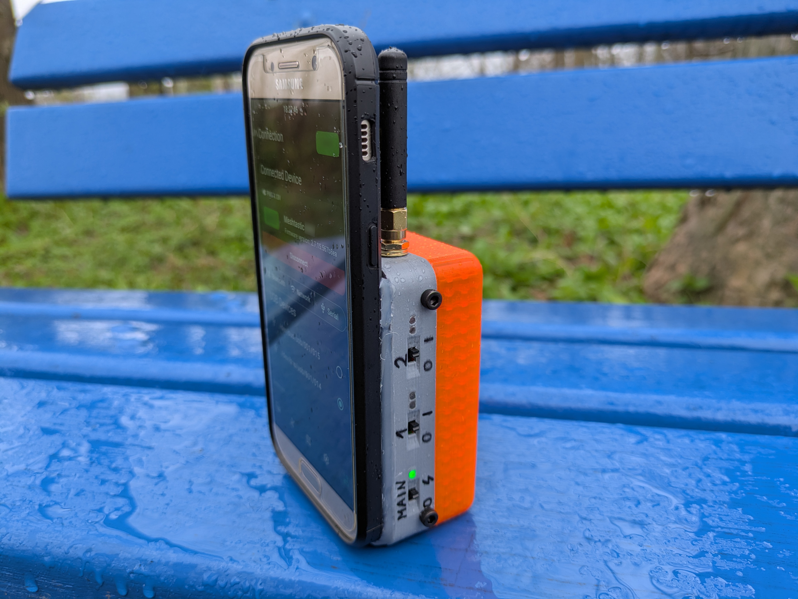
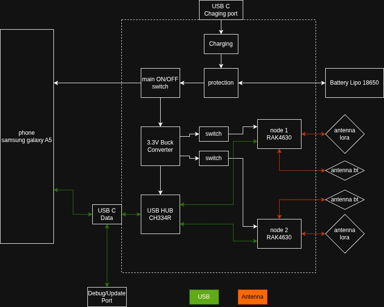
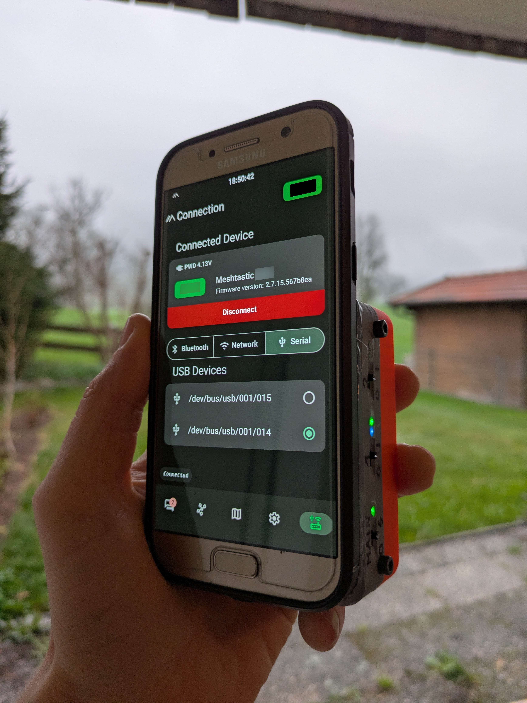
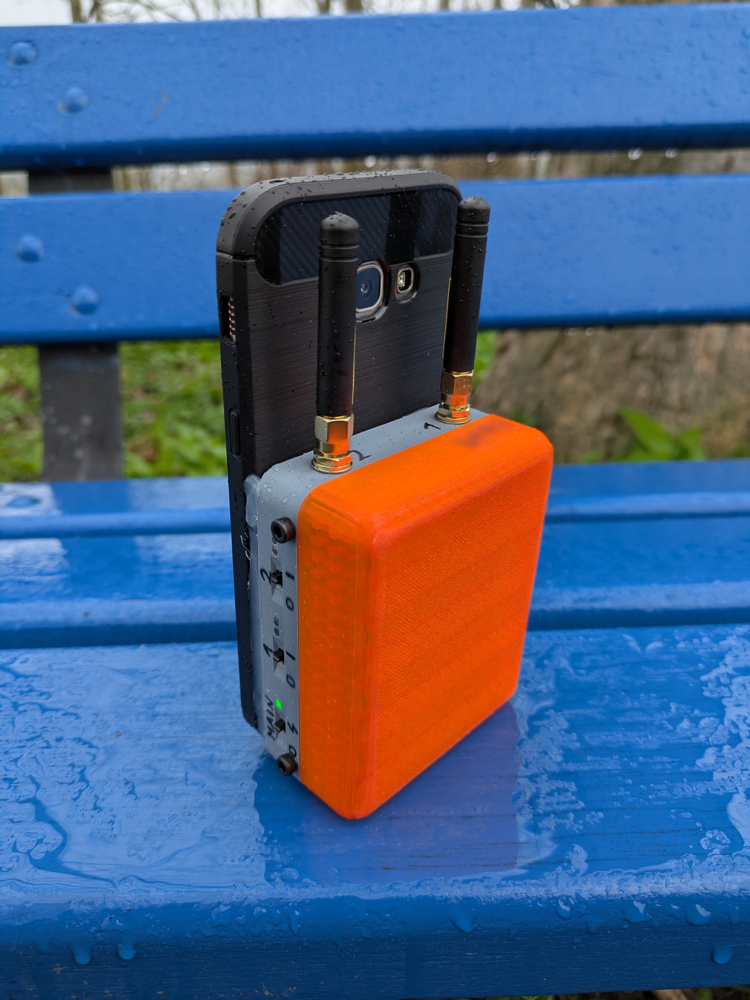
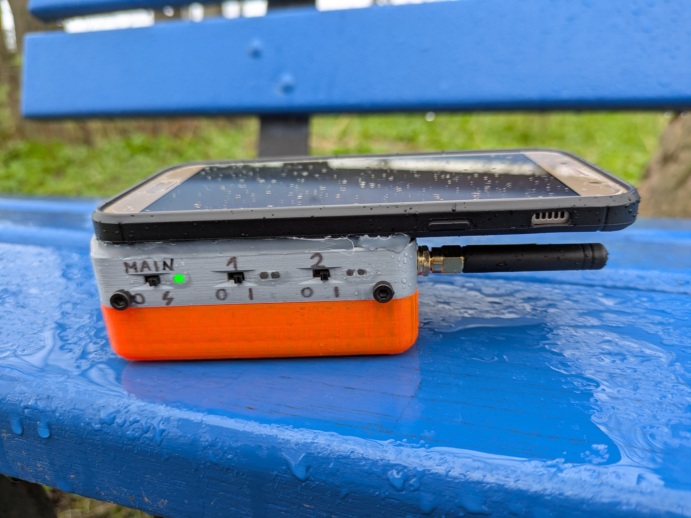
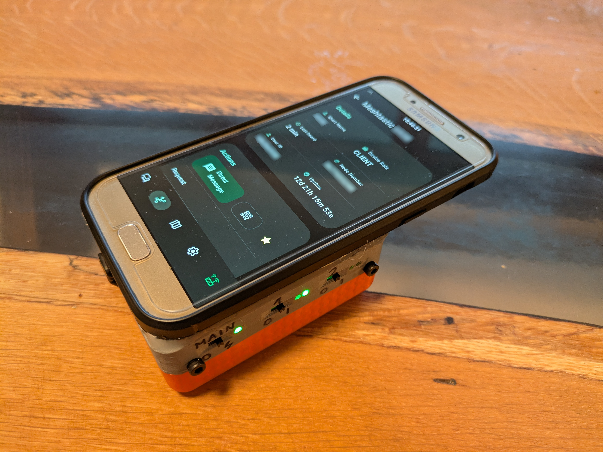
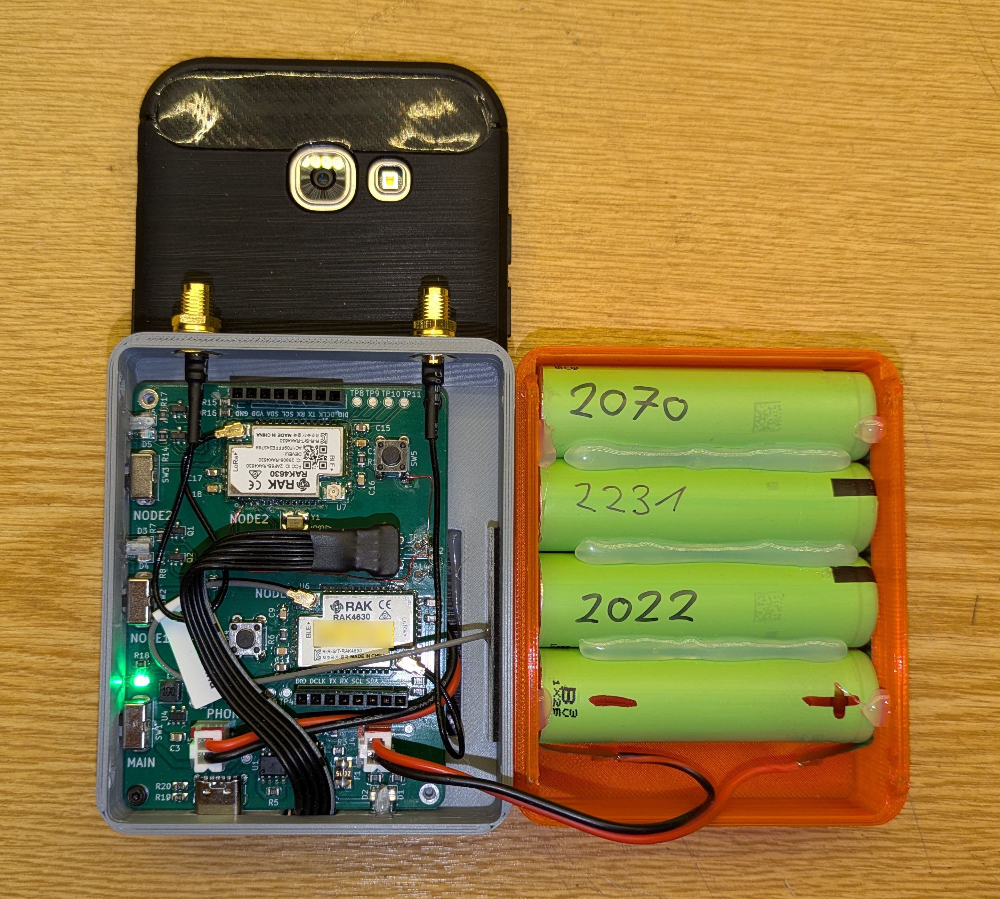
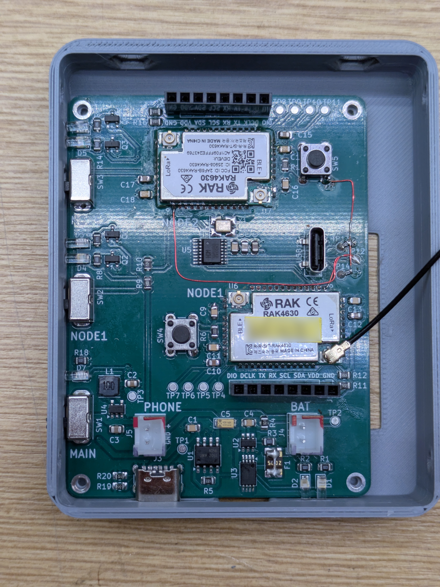
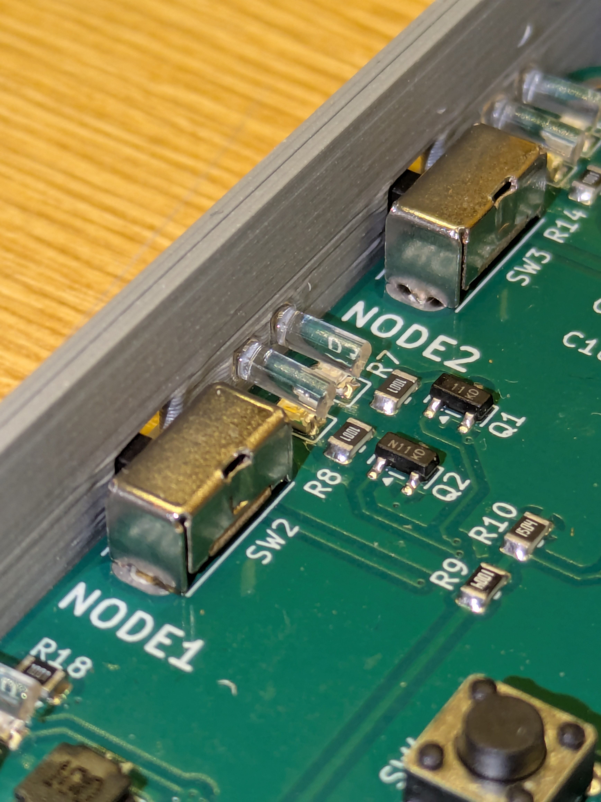

# Meshphone

A standalone dual-node Meshtastic/MeshCore device built into a Samsung Galaxy A5 form factor.

## Overview

Meshphone is a custom dual-node Meshtastic device featuring:
- Two RAK4630 modules for simultaneous operation with different presets/protocols
- Integrated USB hub for clean connectivity
- 8000mAh 4P 18650 LiPo battery (~48h runtime)
- Samsung Galaxy A5 chassis (€20 eBay find)

## Why Build This?

Off-the-shelf standalone devices like the T-Deck lack the full feature set available in Meshtastic/MeshCore. By making it a dual-node device, I can run two different configurations simultaneously. The nodes connect through a USB hub IC - a cleaner solution than Bluetooth coupling with potential radio interference over short distances.

## Design

### Chassis
The Galaxy A5's internal battery was removed and replaced with external power from the PCB via cables. This allows complete disconnection via switch and increased battery capacity. The phone sits in a cheap TPU case, with 3D printed PLA housing for the nodes and batteries, secured with hot glue.

### Core Components

**RAK4630 Modules** - Chosen for:
- Low power consumption
- Minimal peripheral components
- Integrated USB

Reference designs: RAK4631 and RAK19003 modules.

> **Note:** The RAK USB port requires 5V on VBUS to initialize - learned this during integration and had to bodge it. Fixed in the PCB design.

**Status LEDs (7 total):**
- Charging indicator
- Fully charged indicator
- ON/3.3V OK
- 2x Status Node 1
- 2x Status Node 2

Light channels made from clear PETG filament - works awesome!

**Battery Management:**
- TP4056 + DW01 for charging and protection (classic LiPo charging circuit)
- USB-C charging port on bottom (power only, no data)

**USB Hub - CH334P:**
- First USB project for me
- Chosen for cost and simple reference schematic
- Upstream port centered on PCB
- Phone connects via right-angle USB-C cable
- Pluggable design allows connecting other devices for firmware updates, etc.
- Differential pair routing where possible - USB worked first try!

**3.3V Supply:** TI TPS62203DBVT low-power buck converter

[Schematic PDF](kicad/galaxy_A5_dual_node/galaxy_A5_dual_node.pdf)

### Fixes & Issues

**Bodged during build:**
- USB port didn't activate - forgot 5.1k resistors on CC1/CC2 (fixed in PCB)
- RAK VBUS 5V supply (fixed in PCB)
- Bootloader flash via SWD required for USB drive mode (double-click reset) - used [WisCore RAK4631 Bootloader](https://github.com/oltaco/WisCore_RAK4631_Bootloader)

**Remaining issue:**
When switching on either node, the hub disconnects and reconnects completely, making it impossible to differentiate which node is which USB device. Not sure why this happens, but it's manageable.

## Documentation

- [Component references and links](notes.md)
- [KiCad PCB files](kicad/galaxy_A5_dual_node/)
- [FreeCAD 3D models](freecad/)

## Final Thoughts

This project was an awesome learning experience and I love the result. For future versions I'd do some things differently - most likely keeping the battery in the phone and supplying the whole PCB from the phone's USB port.

## Images

by DerRKDCB

